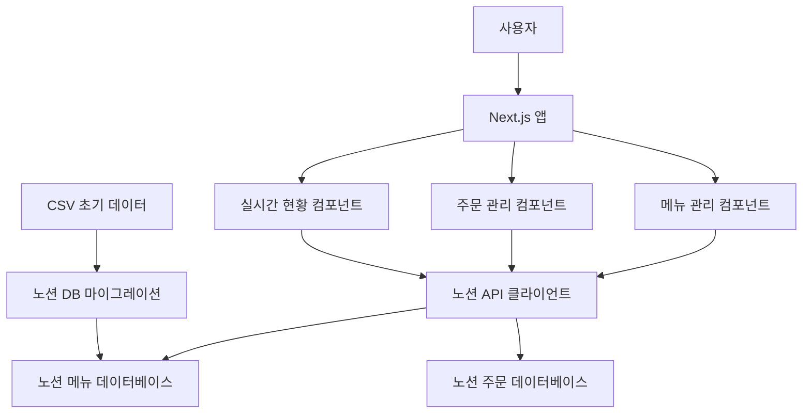

# 팀 커피 주문 웹페이지 디자인 문서

## 개요

Next.js 기반의 팀 커피 주문 관리 시스템으로, 실시간 주문 현황 추적과 두 개 커피 브랜드의 메뉴 관리를 제공합니다. 향후 노션 데이터베이스 연동을 통한 메뉴 관리 기능을 지원할 수 있도록 설계됩니다.

## 아키텍처

### 기술 스택
- **프론트엔드**: Next.js 14 (App Router)
- **스타일링**: Tailwind CSS
- **상태 관리**: React Context API + useReducer
- **데이터베이스**: 노션 데이터베이스 (Notion API)
- **데이터 저장**: 노션 DB (메뉴 데이터 + 주문 데이터)
- **타입스크립트**: 타입 안전성 보장

### 시스템 아키텍처



## 컴포넌트 및 인터페이스

### 페이지 구조
```
/
├── page.tsx (메인 페이지 - 브랜드 선택)
├── order/
│   └── [brand]/
│       └── page.tsx (주문 페이지)
└── status/
    └── page.tsx (주문 현황 페이지)
```

### 핵심 컴포넌트

#### 1. BrandSelector 컴포넌트
- 우지커피, 카페게이트 탭 메뉴
- 선택된 브랜드 상태 관리
- 주문 버튼으로 해당 브랜드 주문 페이지 이동

#### 2. MenuGrid 컴포넌트
- 메뉴 아이템들을 그리드 형태로 표시
- 메뉴 이미지, 이름, 가격 표시
- 가격이 없는 경우 "-" 표시
- 패스 옵션 포함

#### 3. MenuItem 컴포넌트
- 개별 메뉴 아이템 표시
- 클릭 시 선택 상태 토글
- 선택된 메뉴 시각적 피드백

#### 4. OrderForm 컴포넌트
- 주문자 이름 입력
- 선택된 메뉴 확인
- 주문 완료 처리

#### 5. OrderStatus 컴포넌트
- 실시간 주문 현황 표시
- 주문자별 메뉴 리스트
- 메뉴별 수량 카운팅
- 전체 주문 진행률 (설정된 인원 중 몇 명)

#### 6. PassOption 컴포넌트
- 주문하지 않는 팀원을 위한 패스 옵션
- 이름 입력 후 "주문 안함" 상태로 등록

#### 7. TeamSettings 컴포넌트
- 팀 인원수 설정 입력 폼
- 인원수 저장 및 관리
- 설정값 검증 (1-50명)

#### 8. NotionService 클래스
- 노션 API 연동 서비스
- 메뉴 데이터 실시간 조회
- 주문 데이터 생성, 조회, 업데이트
- 데이터베이스 쿼리 및 캐싱
- 실시간 주문 현황 동기화

## 데이터 모델

### Menu 인터페이스 (노션 DB 기반)
```typescript
interface Menu {
  id: string; // 노션 페이지 ID
  brand: 'OOZY COFFEE' | '카페게이트';
  category: string;
  name: string;
  price: number | null;
  image?: string; // 노션 파일 URL
  options?: {
    temperature?: 'HOT' | 'ICE';
    size?: string;
  };
  notionProperties: {
    createdTime: string;
    lastEditedTime: string;
  };
}
```

### NotionDatabase 설정
```typescript
interface NotionMenuDatabase {
  databaseId: string;
  properties: {
    brand: { select: { name: string } };
    category: { select: { name: string } };
    item_name_ko: { title: { plain_text: string } };
    price_krw: { number: number | null };
    image: { files: Array<{ file: { url: string } }> };
    options_json: { rich_text: { plain_text: string } };
  };
}
```

### Order 인터페이스 (노션 DB 기반)
```typescript
interface Order {
  id: string; // 노션 페이지 ID
  customerName: string;
  menuId: string | null; // 노션 메뉴 페이지 ID, null인 경우 패스
  menuName: string;
  brand: string;
  timestamp: Date;
  status: 'ordered' | 'passed';
  notionProperties: {
    createdTime: string;
    lastEditedTime: string;
  };
}
```

### NotionOrderDatabase 설정
```typescript
interface NotionOrderDatabase {
  databaseId: string;
  properties: {
    customer_name: { title: { plain_text: string } };
    menu_id: { relation: { id: string } | null };
    menu_name: { rich_text: { plain_text: string } };
    brand: { select: { name: string } };
    status: { select: { name: 'ordered' | 'passed' } };
    order_date: { date: { start: string } };
  };
}
```

### OrderState 인터페이스
```typescript
interface OrderState {
  orders: Order[];
  totalMembers: number; // 관리자가 설정한 팀 인원수
  orderedCount: number;
  passedCount: number;
}
```

### TeamSettings 인터페이스
```typescript
interface TeamSettings {
  totalMembers: number;
  createdAt: Date;
  updatedAt: Date;
}
```

## 에러 처리

### 클라이언트 사이드 에러
- 노션 API 연결 실패 시 캐시된 데이터 사용
- 잘못된 입력 데이터 검증 및 사용자 피드백
- 중복 주문 방지 (노션 DB에서 같은 이름 조회 후 경고)
- 노션 API 요청 제한 초과 시 재시도 로직

### 데이터 검증
- 주문자 이름 필수 입력 검증
- 메뉴 선택 여부 확인
- 팀원 수 설정값 검증 (최소 1명, 최대 50명)

### 에러 상태 관리
```typescript
interface ErrorState {
  message: string;
  type: 'warning' | 'error' | 'info';
  timestamp: Date;
}
```

## 테스트 전략

### 단위 테스트
- 메뉴 데이터 파싱 로직
- 주문 상태 관리 리듀서
- 컴포넌트 렌더링 및 상호작용

### 통합 테스트
- 주문 플로우 전체 과정
- 실시간 상태 업데이트
- 브랜드 간 전환 기능

### E2E 테스트
- 사용자 주문 완료 시나리오
- 패스 선택 시나리오
- 주문 현황 확인 시나리오

## 성능 최적화

### 클라이언트 최적화
- 메뉴 이미지 lazy loading
- 컴포넌트 메모이제이션 (React.memo)
- 상태 업데이트 최적화 (useCallback, useMemo)

### 데이터 관리
- 노션 API를 통한 실시간 메뉴 데이터 조회
- 노션 API를 통한 주문 데이터 생성 및 실시간 조회
- 노션 데이터 캐싱으로 성능 최적화
- 실시간 주문 현황 폴링 또는 웹소켓 연동
- 불필요한 리렌더링 방지

### 노션 API 연동 전략
- 환경변수를 통한 노션 토큰 및 데이터베이스 ID 관리 (메뉴 DB, 주문 DB)
- API 요청 제한 고려한 캐싱 전략
- 주문 데이터 실시간 동기화를 위한 폴링 전략
- 오프라인 모드 지원 (캐시된 데이터 사용)

### 노션 데이터베이스 구조
1. **메뉴 데이터베이스**: 커피 메뉴 정보 관리
2. **주문 데이터베이스**: 팀원 주문 내역 실시간 관리

## 향후 확장성

### 추가 기능 고려사항
- 주문 마감 시간 설정
- 주문 수정/취소 기능
- 관리자 대시보드
- 주문 내역 엑스포트